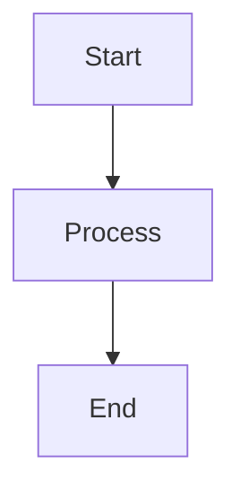
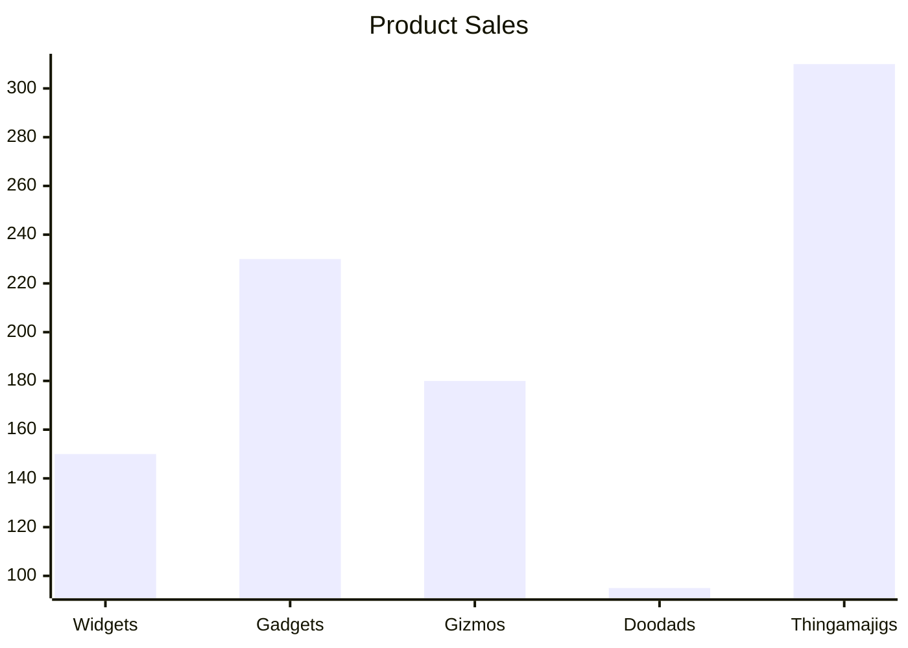
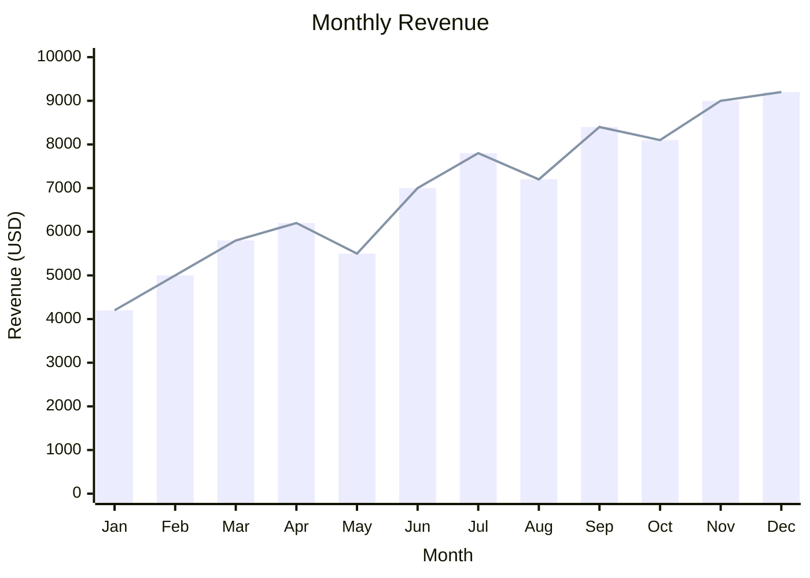
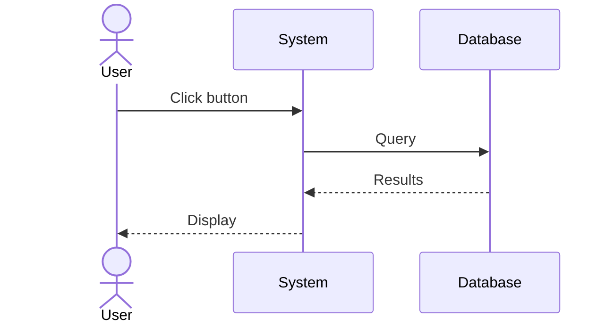
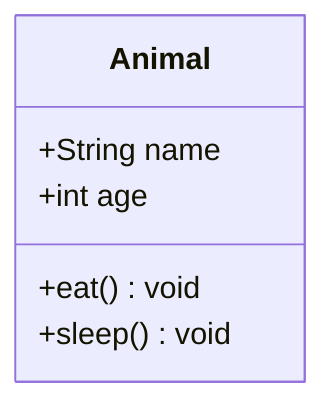
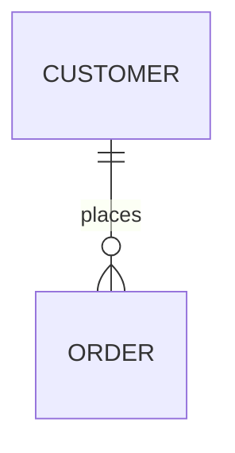
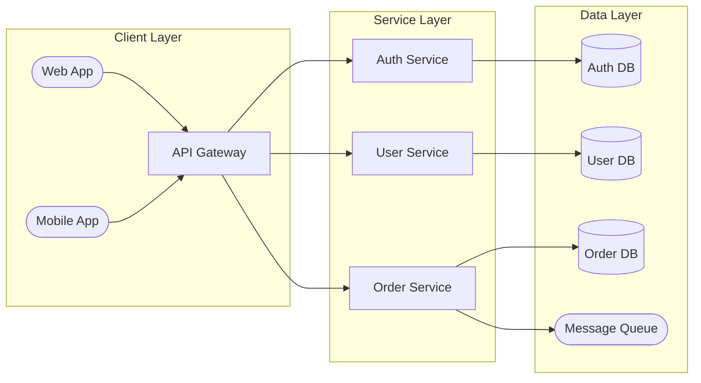

# Basic Demos

These demos are adapted from the `beautiful-mermaid` samples to demonstrate the variety of diagrams supported.

## Simple Flowchart

A basic top-down flowchart.

## XY Charts

Modern bar and line charts.

### r Chart

### xed Line & Bar Chart

## Sequence Interaction

A sequence diagram with actor stick figures and aliases.

## Class Structure

A simple class definition with visibility markers.

## Entity Relationship

A basic relationship between two entities.

## System Architecture

A more complex architecture using subgraphs and different node shapes.

