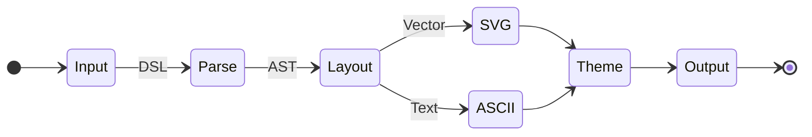

  
<VueLogo size="64px" />

  <h1 class="gradient-name text-[2rem] font-bold leading-tight mb-4">Vue Component</h1>
  
Standalone Vue 3 component to render diagrams in any application.

  
  <a href="/guide/vue" class="btn-brand">Get Started</a>

  
<VitePressLogo size="64px" />

  <h1 class="gradient-name text-[2rem] font-bold leading-tight mb-4">VitePress Plugin</h1>
  
VitePress plugin with build-time SVG rendering and full Markdown integration.

  
  <a href="/guide/vitepress" class="btn-brand">Get Started</a>

  Powered by <a href="https://github.com/lukilabs/beautiful-mermaid" target="_blank" rel="noopener" class="text-brand-1 hover:underline">Beautiful Mermaid</a>

  <button class="px-4 py-1.5 rounded-md text-sm font-medium transition-colors cursor-pointer" :class="tab === 'svg' ? 'bg-brand-soft text-brand-1' : 'text-text-2 hover:text-text-1'" @click="tab = 'svg'">SVG</button>
  <button class="px-4 py-1.5 rounded-md text-sm font-medium transition-colors cursor-pointer" :class="tab === 'ascii' ? 'bg-brand-soft text-brand-1' : 'text-text-2 hover:text-text-1'" @click="tab = 'ascii'">ASCII</button>

  

    
✨

    <h3 class="m-0 mb-3 text-lg font-semibold">Beautiful by Default</h3>
    
Uses beautiful-mermaid for a modern and clean look out of the box. No more clunky, outdated diagram styles.

  

  

    
⚡

    <h3 class="m-0 mb-3 text-lg font-semibold">Build-time Rendering</h3>
    
Diagrams are pre-rendered during build. This means zero runtime overhead, faster page loads, and perfect SEO.

  

  

    
🌐

    <h3 class="m-0 mb-3 text-lg font-semibold">Full SSR Support</h3>
    
Works perfectly in server-side rendering environments. No browser DOM required for the initial render.

  

